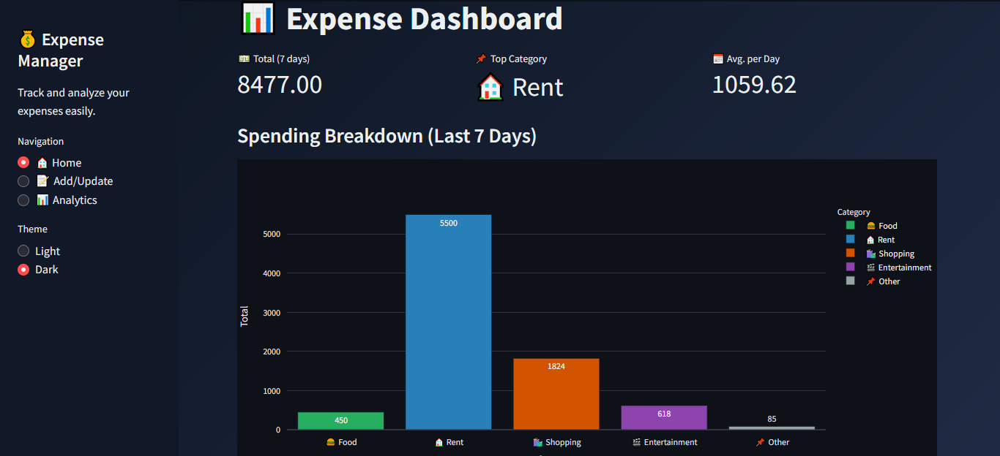
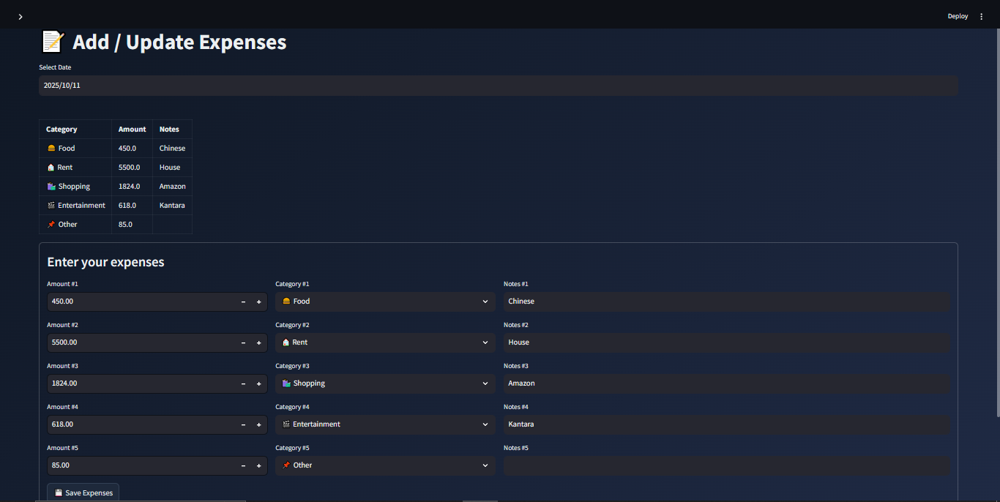
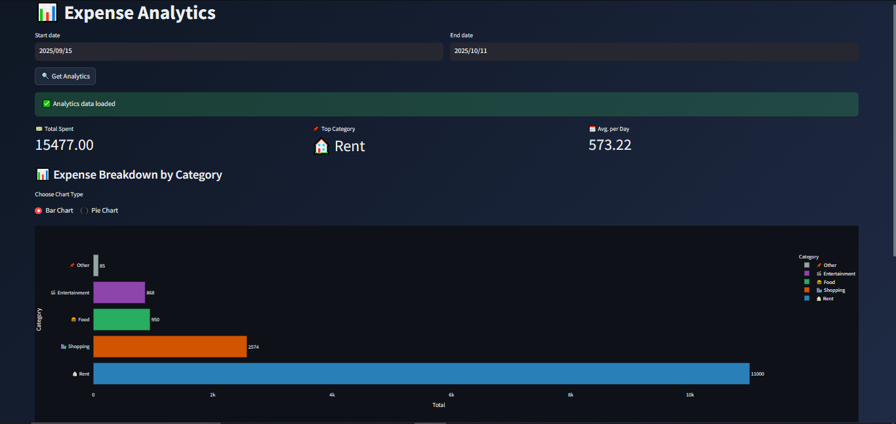
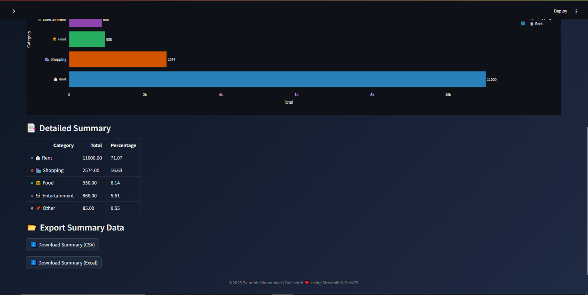
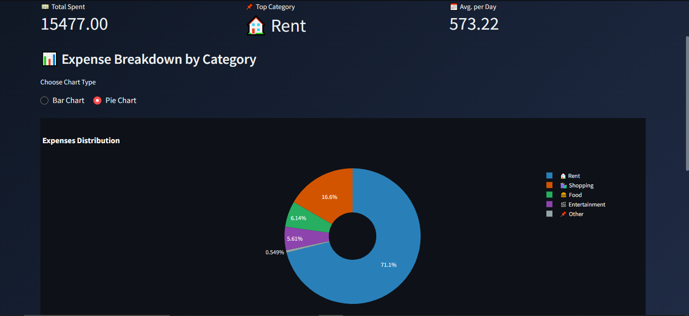
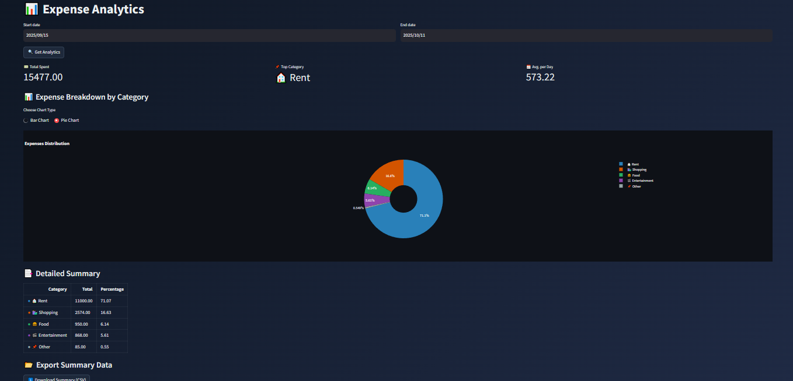

# 💰 Expense Manager

A full-stack **Expense Management Web Application** built using **Streamlit (Frontend)** and **FastAPI (Backend)**.  
It helps users **track, manage, analyze, and export** their daily expenses with beautiful visualizations, real-time analytics, and a clean modern UI.

---

# 📸 Application Preview

## 🏠 Dashboard Home



---

## ✍️ Add / Update Expenses



---

## 📊 Analytics Dashboard (Bar Chart)



---

## 📈 Detailed Analytics & Export



---

## 🥧 Expense Distribution (Pie Chart)



---

## 📑 Summary & Insights



---

# 🚀 Features

✅ **Add / Update Expenses**  
Quickly log and manage daily expenses with categories and notes.

✅ **Interactive Analytics Dashboard**  
Visualize expenses using dynamic **Bar Charts** and **Pie Charts** powered by Plotly.

✅ **Expense Insights**  
Get:
- Total spending
- Top spending category
- Average expense per day
- Category-wise distribution

✅ **Theme Support**  
Seamless **Light 🌞** and **Dark 🌙** modes for a modern user experience.

✅ **Summary Tables & Data Export**  
Download analytics reports as:
- CSV
- Excel

✅ **Fast & Lightweight Architecture**  
Built using modern Python frameworks:
- Streamlit
- FastAPI

---

# 🧠 Tech Stack

| Layer | Technology |
|-------|-------------|
| **Frontend** | Streamlit |
| **Backend** | FastAPI |
| **Database** | MySQL (Configurable) |
| **Visualization** | Plotly |
| **Styling** | Custom CSS |
| **Export Tools** | Pandas, XlsxWriter |

---

# 📂 Project Structure

```bash
expense-manager/
│
├── backend/          # FastAPI backend server
├── frontend/         # Streamlit frontend application
├── tests/            # Unit and integration tests
├── images/           # README screenshots and UI previews
├── requirements.txt  # Python dependencies
└── README.md
```

---

# ⚙️ Installation & Setup

## 1️⃣ Clone the Repository

```bash
git clone https://github.com/Saurabh136/Expense_Manager.git
cd expense-management-system
```

---

## 2️⃣ Install Dependencies

```bash
pip install -r requirements.txt
```

---

## 3️⃣ Run the FastAPI Backend

```bash
uvicorn server.server:app --reload
```

Backend will run on:

```bash
http://127.0.0.1:8000
```

---

## 4️⃣ Run the Streamlit Frontend

```bash
streamlit run frontend/app.py
```

Frontend will run on:

```bash
http://localhost:8501
```

---

# 📊 Analytics Features

The analytics dashboard provides:

- 📈 Expense trend analysis
- 📊 Category-wise breakdown
- 🥧 Pie chart distribution
- 📋 Detailed summary tables
- 📥 CSV & Excel report downloads
- 📅 Date-range filtering

---

# 🌙 Theme Support

The application includes:
- 🌞 Light Mode
- 🌙 Dark Mode

with custom theme-aware styling for enhanced user experience.

---

# 🔮 Future Improvements

- 🔐 User Authentication (JWT)
- ☁️ Cloud Deployment
- 📱 Mobile Responsive Design
- 🤖 AI-based Spending Insights
- 📅 Monthly Budget Planning
- 📧 Email Expense Reports
- 🐳 Docker Support

---

# 🚀 Deployment

The application can be deployed using:

| Service | Purpose |
|----------|----------|
| Streamlit Cloud | Frontend Hosting |
| Render / Railway | FastAPI Backend |
| Railway / PlanetScale | MySQL Database |

---

# 👨‍💻 Author

**Saurabh Mhamunkar**

Built with ❤️ using **Streamlit** & **FastAPI**


